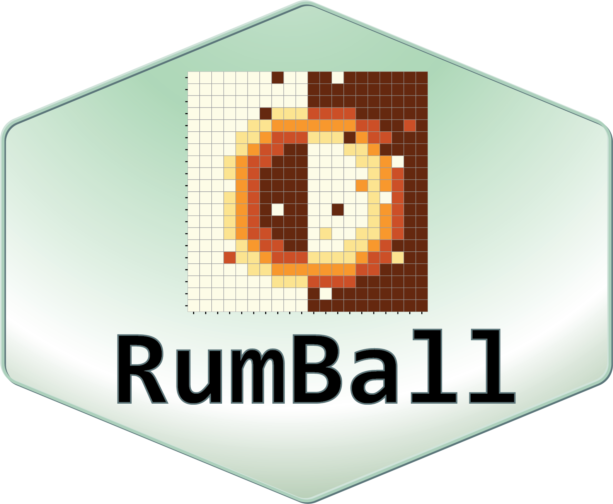
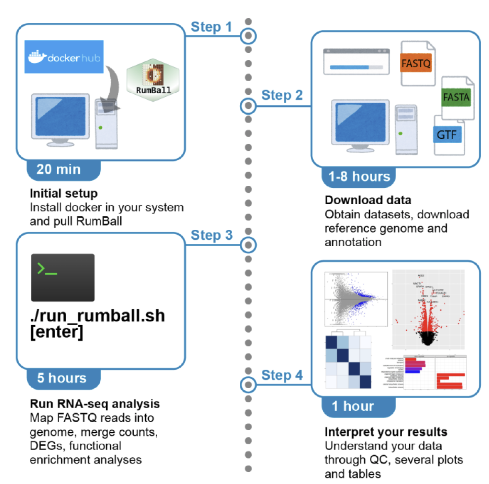

#  RumBall: RNA-seq analysis platform with Docker

## 0. Changelog

See [Changelog](https://github.com/rnakato/RumBall/blob/main/ChangeLog.md)

## 1. Installation

Docker image is available at [DockerHub](https://hub.docker.com/r/rnakato/rumball).

### 1.1 Docker

To use the docker command, type:

    # Pull docker image
    docker pull rnakato/rumball

    # Container login
    docker run --rm -it rnakato/rumball /bin/bash
    # Execute a command
    docker run -it --rm rnakato/rumball <command>

- user:password
    - ubuntu:ubuntu

### 1.2 Singularity

Singularity is the alternative way to use the docker image.
With this command you can build the singularity file (.sif) of RumBall:

    singularity build rumball.sif docker://rnakato/rumball

Instead, you can download the RumBall singularity image from our [Dropbox](https://www.dropbox.com/scl/fo/lptb68dirr9wcncy77wsv/h?rlkey=whhcaxuvxd1cz4fqoeyzy63bf&dl=0) (We use singularity version 3.8.5).

Then you can run RumBall with the command:

    singularity exec rumball.sif <command>

Singularity will automatically mount the current directory. If you want to access the files in the other directory, use the `--bind` option, for instance:

    singularity exec --bind /work rumball.sif <command>

This command mounts the `/work` directory.

## 2. Usage

See https://rumball.readthedocs.io for the detailed Manual.

## 3. Build Docker image from Dockerfile

First clone and move to the repository

    git clone https://github.com/rnakato/RumBall.git
    cd RumBall/Dockerfiles

Then type:

    docker build -f Dockerfile.<version> -t <account>/rumball

## 4. Reference

- Nagai LAE, Lee S, Nakato R. Protocol for identifying differentially expressed genes using the RumBall RNA-seq analysis platform, *STAR Protocols*, 2024. doi: [10.1016/j.xpro.2024.102926](https://doi.org/10.1016/j.xpro.2024.102926)
